

### [website](https://mechmania.org) | [python-starterpack](https://github.com/MechMania-29/python-starterpack) | [java-starterpack](https://github.com/MechMania-29/java-starterpack) | [visualizer](https://github.com/MechMania-29/Visualizer) | [engine](https://github.com/MechMania-29/engine) | wiki

# Infection Wiki
Please be advised: There has been a large spike in recorded cases recently, reports indicate that the virus has mutated into something new and highly dangerous. Infected people are becoming zombies! Even more, the government has declared a state of emergency, and a quarantine zone has been established with us in it! If we survive long enough, we might find a way to escape.

---

## Contents
- [Overview and Objectives](#overview-and-objectives)
- [Humans and Zombies](#humans-and-zombies)
    - [Turn Order](#turn-order)
    - [Humans](#humans)
    - [Zombies](#zombies)
- [Obstacles](#obstacles)
- [Further Questions](#further-questions)
- [Disclaimer](#disclaimer)

# Overview and Objectives
Infection is a 1v1 Apocalyptic survival game where you hunt or be hunted. One player will control all the humans, trying to evade the zombies and survive for as long as possible. The other will control all the zombies, pursuing, attacking, and infecting the remaining humans. Stay alert, the horde cannot be stopped.

## Map
The landscape is a 100x100 square grid containing buildings, trees, rivers, and many obstacles. Some of these obstacles can be destroyed to create a new path. The coordinates of the top left is (0,0) while the bottom right is (99,99). Every game will have the same map.

    

> The landscape, humans spawn in the center while zombies near the top

## Endgame
The game ends after **200** turns, or after all humans have fallen. Humans earn more points the longer they survive, while zombies earn points the quicker they infect all humans.

## Scoring:
Human points = `end_turn + (humans_alive * 5)`

Zombie points = `200 - end_turn + (humans_infected * 5)`

# Humans and Zombies
In a game, a bot will either control all of the zombies or all of the humans. Each side has unique stats and attributes to take advantage of. 
## Turn Order:
Zombies will have their turn first, then humans second. A single turn is made up of multiple phases for either the zombies or humans. Odd turns are the zombies, while even turns are for the humans. Multiple characters can stand in the same tile.

### Zombie phases:

#### 1. Movement
- Choose a location within range to move to immediately. If the location cannot be reached, the zombie will not move.
#### 2. Attack
- Choose any human or obstacle within range to attack, decreasing health or durability by **1** respectively.

### Human phases:
#### 1. Movement
- Choose a location within range to move to immediately. If the location cannot be reached, the human will not move.
#### 2. Attack
- Choose any zombie or obstacle within range to attack, stunning it or decreasing durability by **1** respectively.
#### 3. Ability
- Use any available active ability the human possesses.

## Humans:
The game begins with **20** humans. Each human can have a class that gives them special abilities and stats. If a zombie is within the range of a human, the human can shoot and stun it for **1** turn. Multiple attacks on a zombie in a single turn will not stack the number of turns it will remain stunned.
If a human loses all health, they will turn and become a zombie by the next zombie turn.

At the start of the game, **16** humans can have a chosen class, the rest will have the Normal class.

Up to **5** humans can have the same class.

Humans can attack either an obstacle or a single zombie. Attacking an obstacle removes **1** durability from it. Attacking a zombie will stun it.

- Health: How many hits a human can take before falling, **max 10 health**
- Speed: The distance a human can travel in a single turn
- Range: The distance a human can attack, Some obstacles can block the attack, however
- Cooldown: The number of turns a human must wait before they can attack again. This includes zombie turns.
- Passive Ability: Abilities that automatically occur
- Active Ability: Abilities that are actively used in the ability phase
  
All human distances are calculated with Manhattan Distance
- DManhattan = |x2 - x1| + |y2 - y1|

|  Class  | Health | Move Speed |Attack Range|Attack cooldown|Ability|Description| |
|--------|--------|--------|-------|-------|-------|-------|-------|
|Normal|1|3|4|8|None|Talents truly shine when the world calls for it.| 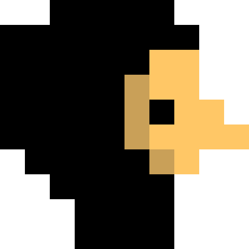 |
|Marksman|1|3|6|6|None|Hunting scopes are more effective when used properly, like when it isn’t on a sword.| 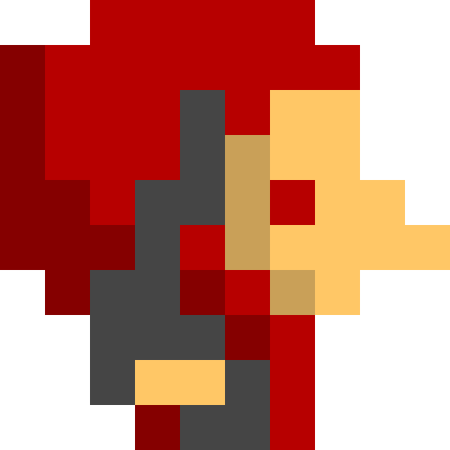 |
|Traceur|1|4|2|4|(Passive) Can move on top of barricades|Isn’t parkour the greatest skill to have in a post-apocalyptic world?| 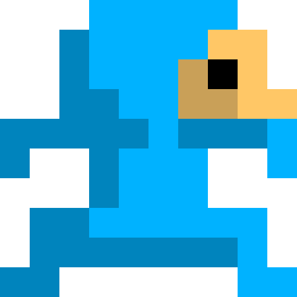 |
|Medic|2|3|3|6|(Active) Give another human within attack range +1 health. Cooldown **6** turns|The place to save lives is in the field, not an office.| 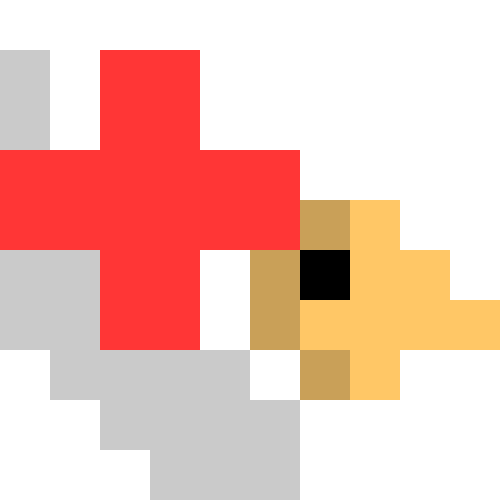 |
|Builder|1|3|4|6|(Active) Place a barricade within attack range, cannot place on top of a human, zombie, or debris. Cooldown **6** turns|You can quickly make a barricade with some duct tape, wood, string, and a barricade.| 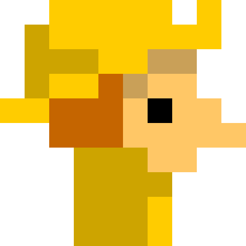 |
|Demolitionist|1|3|2|6|(Passive) Attacks on obstacles will destroy it (except rivers, too many piranhas)|A good demolitionist is one that’s still here.| 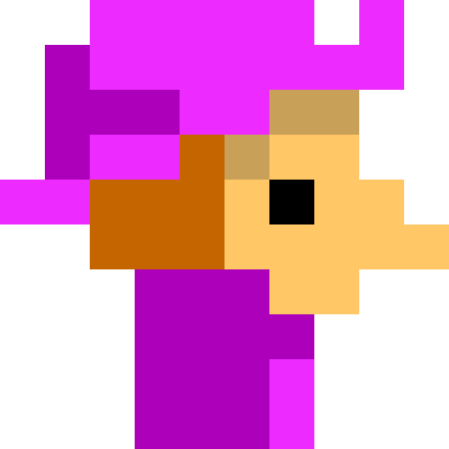 |

## Zombies
The game begins with **6** zombies. When a human falls, they will become a zombie and join the ever growing horde.
Zombies have no attack cooldown, but still can only attack once per turn.
When a zombie is attacked, they will not die, but instead be stunned for **1** turn. While a zombie is stunned, no actions can be performed by that zombie.

Zombie Attack Range uses Chebyshev distance, while Speed uses Manhattan.
- DChebyshev = max( |x2 - x1|, |y2 - y1| )

| Class | Move Speed | Attack Range | Description | |
|------|------|------|------|------|
|Zombie|5|1| Braaainsss...| 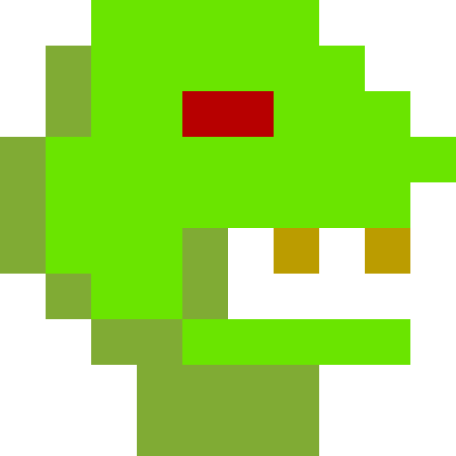 |

# Obstacles
Throughout the landscape there will be different types of obstacles that cannot be passed. They must be destroyed or another path must be taken to bypass objects. When any obstacle is destroyed, its debris is left behind, allowing humans and zombies to pass, but preventing building new obstacles on top. All obstacles block zombie attacks (due to their range), but some do not block human attacks. 

| Type | Durability| Blocks human attacks? | Description | |
|------|------|------|------|------|
|Wall|3|Y|Luckily it’s actually just drywall, unfortunately it’s just drywall.| 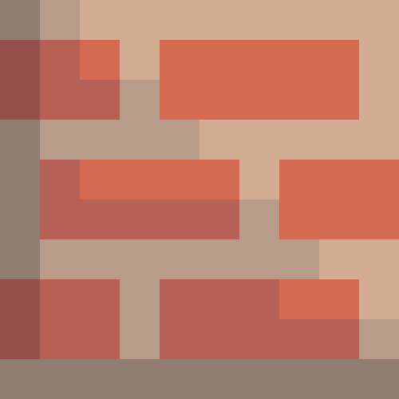 |
|Barricade|1|N|Something is written next to it... DON’T DEAD OPEN INSIDE…?| 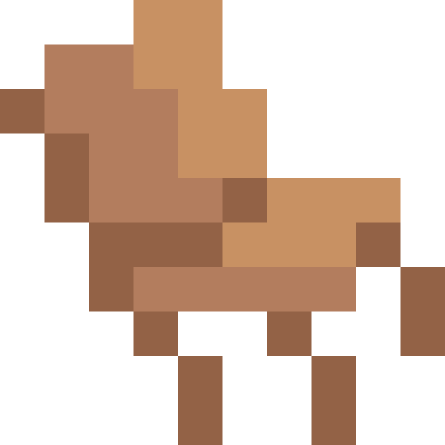 |
|Tree|2|Y|A nice oak tree, don’t punch it.| 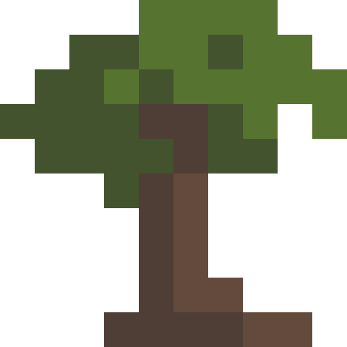 |
|Water|Infinity|N| Zombie Piranhas. | 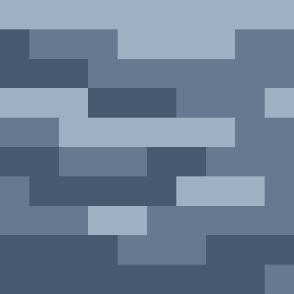 |

# Further questions
If you need something clarified, don't hesitate to ask! You can contact staff in the [MechMania 29 Discord Server](https://discord.gg/Fz2zEM4nGf) through the #ask-a-question-here channel. We'll be providing help throughout the commpetition!

# Disclaimer
In an unlikely event, we may make adjustments to the game in the interest of keeping the game fair, balanced, and diverse in gameplay. 
